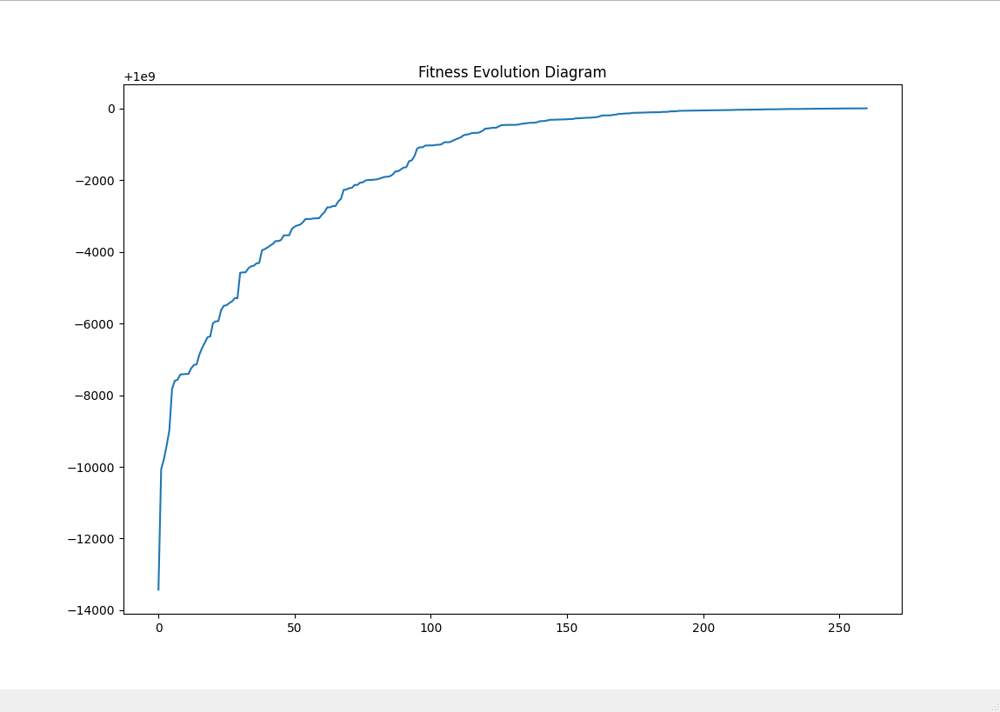

# Genetic Sort 
sorting numbers using genetic algorithm

### requirements
- python3
- matplotlib

### before usage
```sh
git clone https://gitlab.com/amiremohamadi/gasort
cd gasort
```
be sure you installed all requirements already
```sh
virtualenv -p python3 .venv
source .venv/bin/activate
pip install -r requirements.txt
```

### usage
```sh
python gasort -h # to see help of usage
```

read geneset from file
```sh
python gasort -f file.txt
```

read from default stdin
```sh
python gasort 4 3 1 2
```

running tests
```sh
python tests.py
```

### benchmarks
<p align="center"></p>

here's a banchmark of running `gasort` on 50 numbers 10 times

| nth run     | time in seconds | 
|-------------|-------------|
| 1           | 7.030         |
| 2           | 5.630         |
| 3           | 7.446         |
| 4          | 7.740          |
| 5          | 8.040          |
| 5          | 8.040          |
| 6          | 12.41          |
| 6          | 12.41          |
| 7          | 5.633          |
| 8          | 5.633          |
| 9          | 10.72          |
| 10         | 8.418          |

